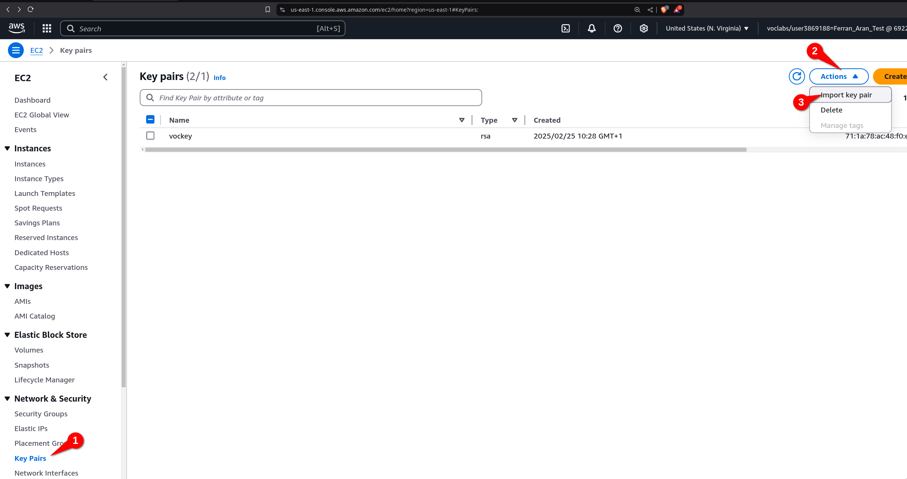
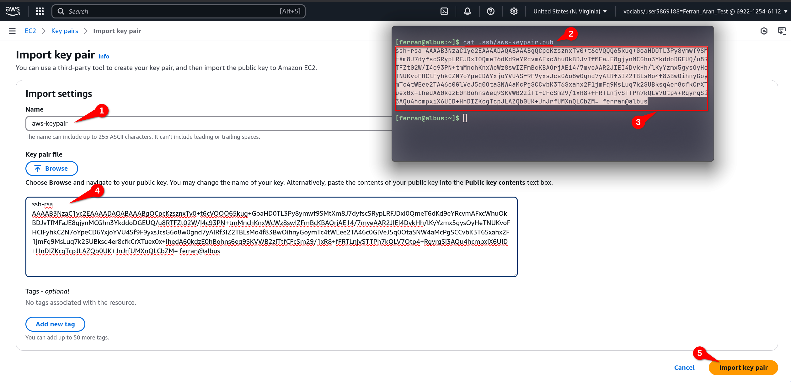
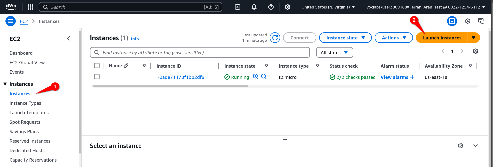
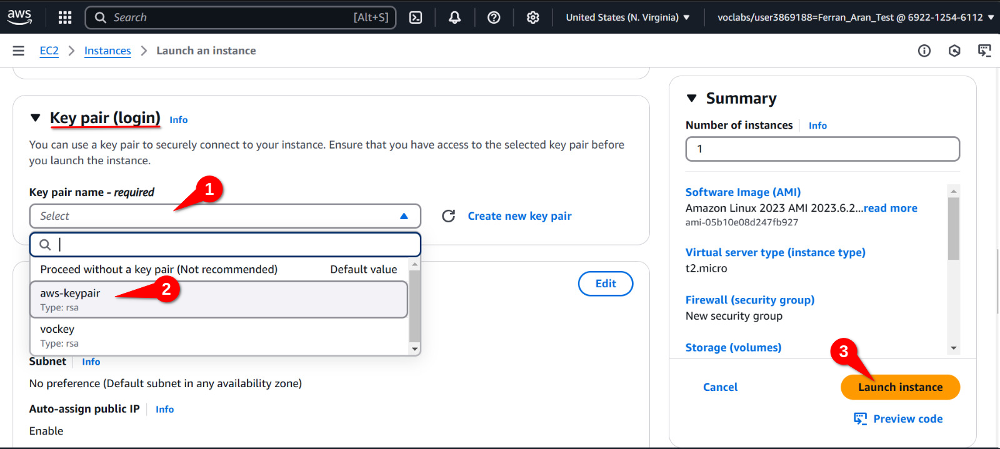

# Guide 1 - Setting up AWS for the first time

Use this guide to **set up AWS for the first time**. If you have already set up AWS and want to work on your project, follow [this guide](./guide2.md).

## Table of contents

- [Introduction](#introduction)
- [Step 1: Creating an AWS Academy account](#step-1-creating-an-aws-academy-account)
- [Step 2: Accessing the AWS Dashboard](#step-2-accessing-the-aws-dashboard)
- [Step 3: Creating an SSH key pair](#step-3-creating-an-ssh-key-pair)
- [Step 3: Importing the public key to AWS](#step-3-importing-the-public-key-to-aws)
- [Step 4: Creating an EC2 instance](#step-4-creating-an-ec2-instance)
- [Step 5: Connecting to the EC2 instance](#step-5-connecting-to-the-ec2-instance)
- [What's next?](#whats-next)

## Introduction

This guide will help you set up your AWS Academy account so you can work on [Hands-On Lab 2](./hol2.md). If you successfully follow this guide you will end up with:

- AWS Academy account created
- Access to the AWS Dashboard
- An SSH key pair on your local machine
- An EC2 instance created with your key pair configured
- A remote terminal on the EC2 instance

Keep in mind that everytime you want to work with your AWS project and a new session is started, you will need to repeat some of the steps in this guide so try to understand what is being done and why.

So just to make it clear, this guide is intended to be followed only once; the first time you set up your AWS account. The next time you want to work on your project you should follow [this guide](./guide2.md).

If you encounter any issues during the setup, please reach out to me at `ferran.aran@udl.cat`, via Teams message or through the Moodle.

```admonish info
This guide will provide links to external resources. Sometimes you will need to visit them to complete the setup and sometimes they are just for you to learn more about the topic. Make sure to follow the instructions carefully.
```

## Step 1: Creating an AWS Academy account

You should have received an email from AWS Academy with the subject "Course Invitation". If you haven't received it, please let me know as I have had to do this by hand and may have missed you. The email will contain a button with the text "Get Started". Click on it to start the registration process. Below is an example of the email you should have received:


After clicking on the "Get Started" button, you will be redirected to the AWS Academy login page. You should now click on "Create my account" to start the registration process as shown below:


Choose a password and finish the registration process. Once you have completed the registration process, you will be redirected to the AWS Academy dashboard. Congratulations! You have successfully created your AWS Academy account.

## Step 2: Accessing the AWS Dashboard

Now that you have created your AWS Academy account, you can access the AWS Dashboard. The first thing you should do is to click on the `Courses` tab on the left side of the screen. You will see a list of courses available to you. Click on the course `AWS Academy Learner Lab` as shown in the screenshot below:

```admonish info
The course `AWS Academy Learner Lab` is the course you will be using to complete the Hands-On Labs (you'll see how in a moment), if you remember on class we talked about the `AWS Academy Cloud Foundations` course, which is not mandatory but highly recommended for those who want to have a stronger foundation. Notice how there's only one course on the screenshot below, that's not what you should be seeing, you should see two courses, one for the `AWS Academy Cloud Foundations` and one for the `AWS Academy Learner Lab`. If you don't see the `AWS Academy Cloud Foundations` course and would like to have access to it, please let me know since, once again, I had to do this by hand and may have missed you.
```

<p align="center">
    
</p>

Now we have to look for the `Modules` tab on the left side of the screen. Click on it and you will see a list of modules available to you. Click on the module `AWS Academy Learner Lab` as shown below:

<p align="center">
    
</p>

You will now be asked to accept the terms and conditions of the course. To do so, scroll all the way down and click on the `I Agree` button.


After accepting the terms and conditions, you will now be just a couple clicks away from accessing the AWS Dashboard. You need to first click on the `Start Lab` button.


```admonish danger title="Important"
I have tested on Firefox and Google Chrome only. **Firefox fails to load the lab**. If your browser is failing to load the lab I suggest trying a different one.
```

Now give it a couple minutes to load. You'll see this animation while the lab is being prepared for you:


Finally, when the lab is ready, you'll see that the dot next to `AWS` is green. You'll also se a timer counting down from 4 hours. This is the time you have to work on the lab. To the left of the timer you'll see how's your budget going. You have a budget of $50 to spend on AWS services. Click on `AWS` to access the AWS Dashboard as shown below.

```admonish warning
If you exceed the $50 budget, you will no longer have acces to the AWS Dashboard and **will loose your work**. Make sure to keep an eye on the budget and if you see that you're getting close to the limit, let me know so I can create a new lab for you.
```


Great! You have now accessed the AWS Dashboard. You will see a screen similar to the one below:


## Step 3: Creating an SSH key pair

Later on this guide we will create an EC2 instance, to work with this remote computer we will need to connect to it using SSH. To do so, we will need an SSH key pair. 

We are going to do this using a terminal on our local machine. Remember that a terminal is a program that allows you to interact with your computer using text commands, if this sounds confusing to you I suggest to read through [this post](https://medium.com/rewrite-tech/getting-friendly-with-the-terminal-a-super-friendly-beginners-guide-7ff0cd6425cd). For windows users you can also read [this post](https://learn.microsoft.com/en-us/windows/terminal/) specifically for the Windows Terminal. MacOS users should already have a terminal installed on their computer. And there is also [this great video](https://www.youtube.com/watch?v=rIp4n3V0_NU) that is aimed towards a general understanding of the terminal tailored for Data Scientists.


```admonish note
It is really important to understand when are we working on our local machine and when are we working on the remote machine. The first step will always be to open a terminal on our own computer, but once we connect to the remote machine through the SSH command, although it may seem like nothing changed, the terminal is now **connected to the remote machine**. This means from now on the commands we type will be executed on the remote machine, not on our local machine. If you're not sure if you're working on your local machine or on the remote machine, just type `pwd` and see what the output is. If it's your local machine, you'll see the path to the directory you're in on your local machine, if it's the remote machine, you'll see the path to the directory you're in on the remote machine. `pwd` stands for `print working directory`.
```

The first step for creating the SSH keypair will be to make sure the `.ssh` directory extists, to do so, open a terminal on your local machine and type the following command:

```bash
mkdir .ssh
```

The command may throw an error if the directory already exists, that's fine, it just means that the directory was already there. Just to get used to the terminal, we'll use the `ls` command to list the contents of the directory. Type the following command:

```bash
ls .ssh
```

You should see no output from the command, that's because the directory is empty. It may be that you already had SSH keys created so in that case the `ls .ssh` command would have written some lines to the terminal listing the files in the `ssh` folder.

Now we are going to create the SSH key pair. Type the following command:

```bash
ssh-keygen -t rsa -f .ssh/aws-keypair
```

You will be asked to enter a passphras. You can leave it empty by pressing `Enter` twice (I suggest you do so for simplicity, if not, each time you connect to the remote machine you'll have to enter the passphrase). You should see an output similar to the one below:

```
Generating public/private rsa key pair.
Enter passphrase (empty for no passphrase):
Enter same passphrase again:
Your identification has been saved in .ssh/aws-keypair
Your public key has been saved in .ssh/aws-keypair.pub
The key fingerprint is:
SHA256:uhINFvYaJh6MbwFQCXdZyrW7W46jFGHUhLglDgQ5OYE ferran@DESKTOP-0841
+---[RSA 3072]----+
|XBooo*+          |
|E.++*o..         |
| O ==o.          |
|. B.=...         |
| o *.=. S        |
|  + o..o         |
| .  ..o .        |
|   .. .*         |
|    .o+..        |
+----[SHA256]-----+
```

Here, `ssh-keygen` is the command to generate the key pair, `-t rsa` specifies the type of key to create, in this case an RSA key, `-f .ssh/aws-keypair` specifies the file name for the key pair. You can name the file whatever you want, but it is important to remember the name you gave it. In this case we are naming it `aws-keypair`. I recommend you name it the same way as I do so you don't get confused later on.

```admonish info
You don't need to fully understand how do public and private keys work and how are they used to make an SSH connection, but if you're interested in learning more **I highly recommend to watch [this video](https://www.youtube.com/watch?v=dPAw4opzN9g)**. Note that they suggest using `putty` to connect to the remote machine when on a Windows computer while I suggest using the terminal, as I said in class this is a personal choice but I will be doing the labs using the terminal so if you want to follow along I suggest you do the same.

<iframe width="100%" height="400" src="https://www.youtube.com/embed/dPAw4opzN9g" title="YouTube video player" frameborder="0" allow="accelerometer; autoplay; clipboard-write; encrypted-media; gyroscope; picture-in-picture" allowfullscreen></iframe>
```

Once again, we can check the contents of the `.ssh` directory by typing the following command:

```bash
ls .ssh
```

And we should now see two files, `aws-keypair` and `aws-keypair.pub`. The first one is the private key and the second one is the public key. The private key should never be shared with anyone, while the public key is the one to be shared with the remote machine. A useful command to inspect the contents of a file is `cat`. For example, to see the contents of the public key, type the following command:

```bash
cat .ssh/aws-keypair.pub
```

```admonish note
You can also inspect the contents of the `.ssh` folder and the files inside it using the File Explorer (or Finder in Mac devices). But **be careful**, by default, folders and files that start with a `.` (like `.ssh`) are hidden in most file explorers and if you want to be able to see them, you'll have to enable the option to show hidden files. Check [this tutorial](https://en.eloutput.com/Tutorials/step-by-step/show-hidden-files-windows-macos/) to see how to do it on your operating system. Another thing to keep in mind is that files extensions (that is the part of the file name that comes after the last `.`, for example `.pdf` in `whatever.pdf`) are also usually hidden, that means that on your File Explorer you may be seeing two files named `aws-keypair` when in reality one is `aws-keypair` and the other is `aws-keypair.pub`. Here is [a tutorial](https://www.gottheknack.com/a-how-to/file-systems/file-ext-and-details-view/file-ext-and-details-view.html) on how to show file extensions on your operating system.

You don't have to worry about any of this if you're using the terminal, the terminal will show you the files and their extensions as they are. **But to see hidden files and folders (those starting with a `.`) you'll have to use the `ls -a` command**.
```

We have now created an SSH key pair that can be used to connect to remote machines. Next up, we are going to be setting up a remote machine on AWS which we can connect to. But first, we need to import our public key to AWS.


## Step 3: Importing the public key to AWS

To import the public key to AWS, we need to go back to the AWS Dashboard, which is where we eneded up after finishing [Step 2](#step-2-accessing-the-aws-dashboard). We are now going to use the **search bar** to look for the `EC2` service. Type `EC2` in the search bar and click on the `EC2` service as shown below:


You will now see the EC2 Dashboard. On the left side of the screen, you will see a list of options. Click on `Key Pairs` > `Actions` > `Import Key Pair` as shown below:



You now have to give the key a name. You can name it whatever you want, but I suggest you name it `aws-keypair` to keep things simple. You will see a text field where you can type, copy the contents of the public key file you created earlier. You can do this by using `cat .ssh/aws-keypair.pub` and copying the output (it may be the case that in order to copy from the terminal you have to use `Ctrl+Shift+C` instead of `Ctrl+C`, or just right click and select `Copy`). Paste the contents of the public key file in the text field and click on `Import Key Pair` as shown below:



```admonish note
You can also click on the `Browse` button to select the public key file from your computer. Just click on `Browse`, navigate to the `.ssh` folder and select the `aws-keypair.pub` file. But remember, the file must be the public key file, not the private key file. That is, the file must have the `.pub` extension. Once you have selected the file, click on `Import Key Pair`.

Keep in mind that as explained on the previous note, you may not see the `.ssh` folder in the file explorer and you may not see the `.pub` extension of the file. If you're having trouble with this, I suggest you use the terminal to copy the contents of the file as shown in the screenshot above.
```

You should now see the key pair you just imported in the list of key pairs. There will probably be another key pair there, that's fine, you can ignore it. Perfect! You have now imported the public key to AWS. Next up, we are going to create an EC2 instance and configure it to use the key pair we just imported.

## Step 4: Creating an EC2 instance

The first step will be to head to the EC2 Dashboard. You can do this by typing `EC2` in the search bar and clicking on the `EC2` service as we did on the begginning of [Step 3](#step-3-importing-the-public-key-to-aws):


Once you are in the EC2 Dashboard, click on `Instances` > `Launch Instance` as shown below:



Leave everything as it is except for the `Key pair (login)` option (you'll have to scroll down to find it). Click on the dropdown menu and select the key pair you imported earlier. In this case, it should be `aws-keypair`. Click on `Launch instance` as shown below:



We now have an EC2 instance running with our public key imported. Which means we have a remote machine on AWS that we can connect to from our local computer using SSH. Let's see how to do that.

## Step 5: Connecting to the EC2 instance

Before connecting to the remote machine, I want you to try the a couple commands on your local machine which we are then going to repeat once we are connected to the remote machine. One of the commands is `pwd` which stands for `print working directory` as alredy discussed earlier. This command will show you the path to the directory you are currently in. The other command is `whoami` which will show you the username of the user you are currently logged in as. Try these commands on your local machine and remember the output. We are going to repeat them once we are connected to the remote machine. 

Below is the output I get on my local machine:

```powershell
PS C:\Users\fnao> pwd

Path
----
C:\Users\fnao


PS C:\Users\fnao> whoami
gft\fnao
PS C:\Users\fnao>
```

```admonish note
My local machine happens to be a Windows laptop, notice that your output will be different. Specially if you are on a Mac or Linux machine.
```

To connect to the EC2 instance, we are going to use the terminal on our local machine. So as we did on the begginning [Step 3](#step-3-creating-an-ssh-key-pair), open a terminal on your local machine. We are going to use the `ssh` command to connect to the remote machine. The command will look like this:

```bash
ssh -i .ssh/aws-keypair ec2-user@<public-ip>
```

You will have to replace `<public-ip>` with the public IP of the EC2 instance. To find the public IP, go back to the EC2 Dashboard and click on `Instances` on the left side of the screen. You will see a list of instances, click on the instance you just created. You will see the public IP on the bottom of the screen as shown below:


Both the `Public IPv4 address` and the `Public IPv4 DNS` can be used as the `<public-ip>` in the `ssh` command. Copy whichever you prefer and paste it in the `ssh` command. The command should look something like this if using the IP address:

```bash
ssh -i .ssh/aws-keypair ec2-user@98.84.68.70
```
or like this if using the DNS:

```bash
ssh -i .ssh/aws-keypair ec2-user@ec2-98-84-68-70.compute-1.amazonaws.com
```

We are going to get a warning the first time we connect to the remote machine. This is normal, just type `yes` and press `Enter`. You should now be connected to the remote machine. You will see a prompt similar to the one below:

```
   ,     #_
   ~\_  ####_        Amazon Linux 2023
  ~~  \_#####\
  ~~     \###|
  ~~       \#/ ___   https://aws.amazon.com/linux/amazon-linux-2023
   ~~       V~' '->
    ~~~         /
      ~~._.   _/
         _/ _/
       _/m/'
Last login: Sun Mar  2 09:50:33 2025 from 79.156.58.43
[ec2-user@ip-172-31-86-82 ~]$
```

Fantastic! We are now connected to the remote machine. It is important to understand that from now on, the commands we type will be executed on the remote machine, not on our local machine. To check this, type the `pwd` and `whoami` commands as we did on our local machine. You should see the output is different. Below is the output I get on the remote machine:

```bash
[ec2-user@ip-172-31-86-82 ~]$ pwd
/home/ec2-user
[ec2-user@ip-172-31-86-82 ~]$ whoami
ec2-user
[ec2-user@ip-172-31-86-82 ~]$
```

```admonish note
This time the output you get should be the same as mine. Notice that the prompt `[ec2-user@ip-172-31-86-82 ~]$` is indeed different but that is not part of the outputs of the commands. The outputs of the commands are `pwd` and `whoami` which are `home/ec2-user` and `ec2-user` respectively. The prompt is just a way to show you where you are in the file system and who you are logged in as.
```

## What's next?

You have now successfully set up AWS for the first time. You have created an AWS Academy account, accessed the AWS Dashboard, created an SSH key pair, imported the public key to AWS, created an EC2 instance and connected to it. All of this and more was covered during [Session 3](./session3.md), this guide is ment to help you get to the point where you have an EC2 instance running and you are connected to it **for the first time**. Once this guide is successfully completed, you should follow [this guide](./guide2.md) to set up your AWS environment each of the next times you want to work with AWS (for example when following [Session 4](./session4.md) or working on [Hands-On Lab 2](./hol2.md)).
