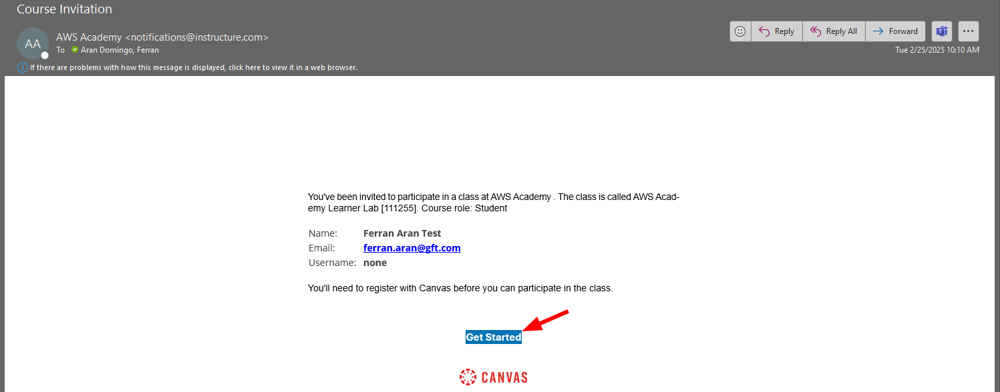
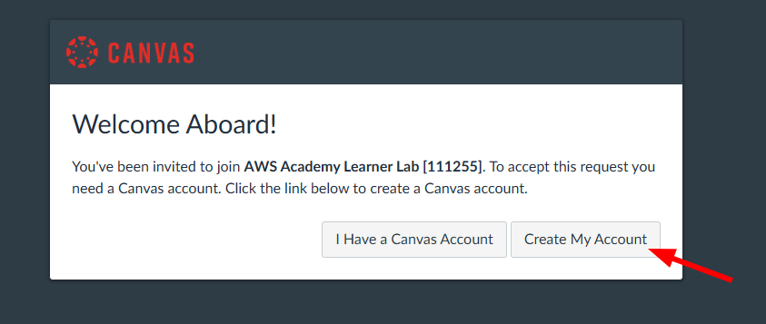
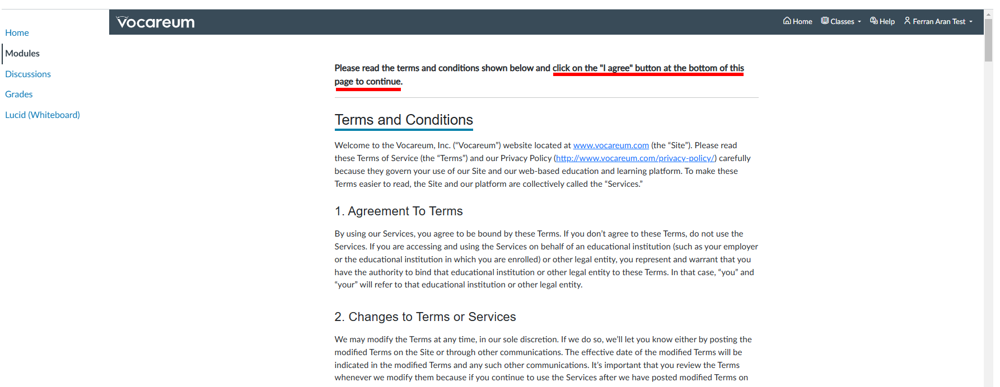

# Guide 1 - Setting up AWS for the first time

Use this guide to **set up AWS for the first time**. If you have already set up AWS and want to work on your project, follow [this guide](./guide2.md).

## Introduction

This guide will help you set up your AWS Academy account so you can work on [Hands-On Lab 2](./hol2.md). If you successfully follow this guide you will end up with:

- AWS Academy account created
- Access to the AWS Dashboard
- An SSH key pair on your local machine
- An EC2 instance created with your key pair configured
- A remote terminal on the EC2 instance

Keep in mind that everytime you want to work with your AWS project and a new session is started, you will need to repeat some of the steps in this guide so try to understand what is being done and why.

So just to make it clear, this guide is intended to be followed only once; the first time you set up your AWS account. The next time you want to work on your project you should follow [this guide](./guide2.md).

If you encounter any issues during the setup, please reach out to me at `ferran.aran@udl.cat`, via Teams message or through the Moodle.

```admonish info
This guide will provide links to external resources. Sometimes you will need to visit them to complete the setup and sometimes they are just for you to learn more about the topic. Make sure to follow the instructions carefully.
```

## Step 1: Creating an AWS Academy account

You should have received an email from AWS Academy with the subject "Course Invitation". If you haven't received it, please let me know as I have had to do this by hand and may have missed you. The email will contain a button with the text "Get Started". Click on it to start the registration process. Below is an example of the email you should have received:



After clicking on the "Get Started" button, you will be redirected to the AWS Academy login page. You should now click on "Create my account" to start the registration process as shown below:



Choose a password and finish the registration process. Once you have completed the registration process, you will be redirected to the AWS Academy dashboard. Congratulations! You have successfully created your AWS Academy account.

## Step 2: Accessing the AWS Dashboard

Now that you have created your AWS Academy account, you can access the AWS Dashboard. The first thing you should do is to click on the `Courses` tab on the left side of the screen. You will see a list of courses available to you. Click on the course `AWS Academy Learner Lab` as shown in the screenshot below:

```admonish info
The course `AWS Academy Learner Lab` is the course you will be using to complete the Hands-On Labs (you'll see how in a moment), if you remember on class we talked about the `AWS Academy Cloud Foundations` course, which is not mandatory but highly recommended for those who want to have a stronger foundation. Notice how there's only one course on the screenshot below, that's not what you should be seeing, you should see two courses, one for the `AWS Academy Cloud Foundations` and one for the `AWS Academy Learner Lab`. If you don't see the `AWS Academy Cloud Foundations` course and would like to have access to it, please let me know since, once again, I had to do this by hand and may have missed you.
```

<p align="center">
    
</p>

Now we have to look for the `Modules` tab on the left side of the screen. Click on it and you will see a list of modules available to you. Click on the module `AWS Academy Learner Lab` as shown below:

<p align="center">
    
</p>

You will now be asked to accept the terms and conditions of the course. To do so, scroll all the way down and click on the `I Agree` button.



After accepting the terms and conditions, you will now be just a couple clicks away from accessing the AWS Dashboard. You need to first click on the `Start Lab` button.


Now give it a couple minutes to load. You'll see this animation while the lab is being prepared for you:


Finally, when the lab is ready, you'll see that the dot next to `AWS` is green. You'll also se a timer counting down from 4 hours. This is the time you have to work on the lab. To the left of the timer you'll see how's your budget going. You have a budget of $50 to spend on AWS services. Click on `AWS` to access the AWS Dashboard as shown below.

```admonish danger
If you exceed the $50 budget, you will no longer have acces to the AWS Dashboard and will loose your work. Make sure to keep an eye on the budget and if you see that you're getting close to the limit, let me know so I can create a new lab for you.
```


Great! You have now accessed the AWS Dashboard. You will see a screen similar to the one below:


## Step 3: Creating an SSH key pair