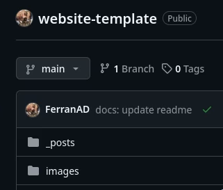

# HOL 01: Deploying your personal website

## Objectives

This hands-on lab aims to introduce you to the basics of cloud computing by deploying a personal website using Jekyll and GitHub Pages. Additionally, you will explore and write a blog entry on a cloud application in biomedicine. 

## Introduction

Github pages hide the complexity of setting up a web server and allow you to host a website for free. This PaaS (Platform as a Service) will enable you to host static websites directly from your GitHub repository. You are responsible for creating the website and pushing it to your repository, and GitHub takes care of the rest.

We are going to use a website template created by [Dean Attali](https://attalitech.com/), his instructions on how to use the tempalte are [here](https://github.com/daattali/beautiful-jekyll), but **don't worry about that**, we are going to use a simplification to make things easier. 

## Prerequisites

- GitHub account (create one at [https://github.com](https://github.com) if you don't have one)

## Tools

- Jekyll (a static site generator) - [https://jekyllrb.com](https://jekyllrb.com)
- GitHub Pages (a static site hosting service) - [https://pages.github.com](https://pages.github.com)

## Task 1: Setting up your personal website

1. Fork [https://github.com/ferranad/website-template](https://github.com/ferranad/website-template) to your GitHub account by clicking on the "Fork" button at the top right corner of this page. 

    

2. Rename the repository to `username.github.io`, where `username` is your GitHub username.

    

3. Go to the repository settings and find the GitHub Pages section.

    

4. Enable GitHub Pages by selecting the `main` branch as the source. Click on the "Save" button and go back to your repository main page.

    

4. Wait for a couple minutes until your website is deployed. When the deployment is done you'll see a green checkmark next to your last commit. You'll see a spinning orange circle while the deployment is in progress (try refreshing the page if you don't see the green checkmark after a few minutes).

    
    

5. You can optionally edit the repository description so it contains the URL of your website. This will make it easier for you and others to access your website from the GitHub repository page.

    

6. Test your website by visiting `https://username.github.io` in your web browser. You'll notice that the website is already populated with some example content.

## Task 2: Customizing your personal website

7. Edit the `_config.yml` file to customize your website. You can use the GitHub web interface to edit the file directly. Personalize to your liking.
8. Commit the changes (use the master branch).

## Task 3: Writing a Blog Entry

1. Explore a cloud application in the field of biomedicine that you are interested in. Use Google Scholar, PubMed, or any other scientific database to find an interesting article.
2. Write a blog about the cloud application you explored on your personal website. You can create a new blog entry using the `/_posts/` directory. The file name should follow the format `YYYY-MM-DD-title.md`. Check the existing blog entries for examples.
3. You can add a new blog entry by navigating to the `/_posts/` directory and clicking the "Add file -> Create a new file" button.
4. Commit the changes (use the master branch).

**Note**: Citations and references should be included in the blog entry for the article selected.

## Task 4: Sharing your personal website
1. Edit the [README.md](https://github.com/HDBC-17705110-MDBS/HandsOnLabs/blob/main/src/README.md) to include a link to your personal website.
2. Commit the changes, creating a pull request to the original repository. 

