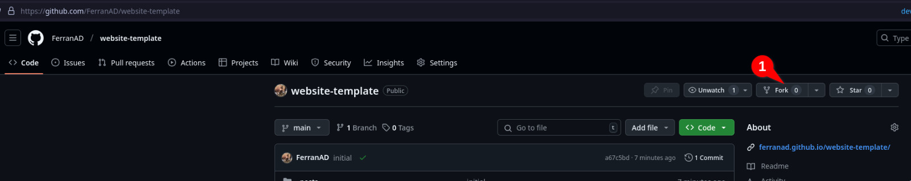
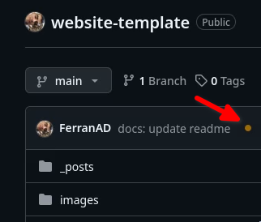
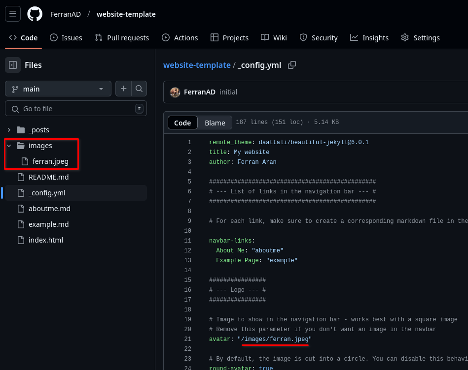

# HOL 01 - Deploying your personal website

## Objectives

This hands-on lab aims to introduce you to the basics of cloud computing by deploying a personal website using Jekyll and GitHub Pages. Additionally, you will explore and write a blog entry on a cloud application in biomedicine. 

## Introduction

Github pages hide the complexity of setting up a web server and allow you to host a website for free. This PaaS (Platform as a Service) will enable you to host static websites directly from your GitHub repository. You are responsible for creating the website and pushing it to your repository, and GitHub takes care of the rest.

We are going to use a website template created by [Dean Attali](https://attalitech.com/), his instructions on how to use the tempalte are [here](https://github.com/daattali/beautiful-jekyll), but **don't worry about that**, we are going to use a simplification to make things easier. 

## Prerequisites

- GitHub account (create one at [https://github.com](https://github.com) if you don't have one)

## Tools

- Jekyll (a static site generator) - [https://jekyllrb.com](https://jekyllrb.com)
- GitHub Pages (a static site hosting service) - [https://pages.github.com](https://pages.github.com)

## Task 1: Setting up your personal website

1. Fork [https://github.com/ferranad/website-template](https://github.com/ferranad/website-template) to your GitHub account by clicking on the "Fork" button at the top right corner of this page. 

    

2. Rename the repository to `username.github.io`, where `username` is your GitHub username.

    

3. Go to the repository settings and find the GitHub Pages section.

    

4. Enable GitHub Pages by selecting the `main` branch as the source. Click on the "Save" button and go back to your repository main page.

    

4. Wait for a couple minutes until your website is deployed. When the deployment is done you'll see a green checkmark next to your last commit. You'll see an orange dot while the deployment is in progress (try refreshing the page if you don't see the green checkmark after a few minutes).

    
    

5. You can optionally edit the repository description so it contains the URL of your website. This will make it easier for you and others to access your website from the GitHub repository page.

    

6. Test your website by visiting `https://username.github.io` in your web browser (replace `username` with your github username). You'll notice that the website is already populated with some example content.

## Task 2: Customizing your personal website

1. Edit the `_config.yml` file to customize your website. You can use the GitHub web interface to edit the file directly as shown on the video below. Once you commit the changes to the main branch, the website deployment will be automatically triggered again and in a couple minutes you'll have your website updated.

    

Instead of editing the file using the Github web interface, you can clone the repository to your local machine and edit the file using a text editor if you feel more comfortable. This is more advanced and requires your computer to have git installed and configured to work with your GitHub account. More information [here](https://github.com/readme/guides/configure-git-environment).

2. Edit the `aboutme.md` file to add your personal information, feel free to write whatever you want. Repeat the same process as in the previous but now editing the `aboutme.md` file.

3. Change the avatar image by editing `_config.yml` and replacing the path. Notice it is just a string with the path to a file present in the repository, in this case, the `images/ferran.jpeg` file. You can upload any image you want to the repository by navigating to the `images` directory and clicking the "Add file -> Upload files" button. If, for example, you uploaded a file called `myavatar.jpg`, you should change the path in `_config.yml` to `images/myavatar.jpg`. If you don't want to use an avatar image, you can remove the line `avatar: "/images/ferran.jpeg` from the `_config.yml` file.

    

## Task 3: Writing a Blog Entry

Now that we have the website tuned up, let's write a blog entry. You may have noticed that on the website home page there is a blogpost called `Sample blog post...` which you can click to fully read. This is a template blog post which you can use to learn the different syntaxes and styles you can use to write your own blog post. That file is located at `_posts/2020-02-26-example-post.md`. You can always refer to that file to see how to write a blog post. In case you don't want it to show on your website, just delete it and refer to [the one in the repository you forked](https://github.com/FerranAD/website-template/blob/main/_posts/2020-02-26-example-post.md?plain=1).

To write a new blogpost, just create a new file inside the `_posts` directory **with the following name format: `YYYY-MM-DD-title.md`**. If you don't follow this format, the blog post won't show up on your website. You can create a new file by navigating to the `_posts` directory and clicking the "Add file -> Create a new file" button. Now that we know how to create a new blog post, let's write one!

1. I want you to explore a cloud application in the field of biomedicine that you are interested in. Use Google Scholar, PubMed, or any other scientific database to find an interesting article.
2. Write a blog about the cloud application you explored on your personal website.

**Note**: Citations and references should be included in the blog entry for the article selected.

## Task 4: Sharing your personal website

This website you are using right now is also hosted on Github Pages, you may have noticed alrady noticed given the URL is [https://hdbc-17705110-mdbs.github.io/HandsOnLabs/](https://hdbc-17705110-mdbs.github.io/HandsOnLabs/). If you take a look at the about page of the website (which is also the home page), you'll see that there is a list of all websites the students have created, I want you to share your own website there by following the steps below:

1. Click [here](https://github.com/HDBC-17705110-MDBS/HandsOnLabs/edit/main/src/README.md) to edit the about page of this website.
2. You'll be asked to create a fork of the repository, do so by clicking on the "Fork this repository" button.
4. A file will be opened, add a line at the end to include your name and a link to your personal website by following the format `[Your Name](https://your-username.github.io)`.
5. Commit the changes by clicking on the "Commit changes.." button and then "Propose changes".
6. Click on the "Create pull request" button to submit your changes and finally click once again on the "Create pull request" button.

If you are interested in understanding more about git and GitHub, I recommend you check [GitHub Guides](https://guides.github.com/).
