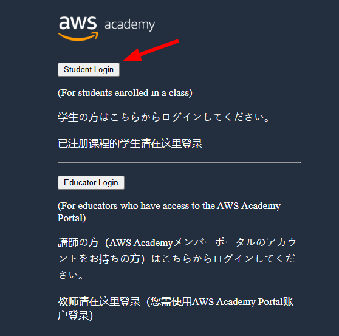
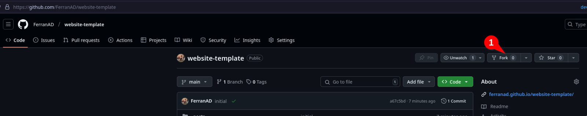

# HOL 02 - Deploying a hybrid infrastructure for researchers in AWS

```
from PIL import Image, ImageDraw, ImageFont

# Create a blank image (RGB, 200x100 pixels, white background)
image = Image.new('RGB', (200, 100), color='white')

# Draw on the image
draw = ImageDraw.Draw(image)
draw.text((50, 40), "Hello!", fill='black')

# Save the image
image.save('test_image.png')

# Show the image (optional, if running interactively)
image.show()
```

```admonish info
Your browser may have kept your session open. If you end up in the AWS Academy dashboard you are good to go and can skip to [Step 2](#step-2-accessing-the-aws-dashboard).
```

<p align="center">
    
</p>

<p align="center">
    
</p>

<!-- warning  i note tambe  -->

```admonish danger title="Important"
I have tested on Firefox and Google Chrome only. **Firefox fails to load the lab**. If your browser is failing to load the lab I suggest trying a different one.
```

```
import boto3
import json
import os
import urllib.parse

s3 = boto3.client('s3')

def lambda_handler(event, context):
    # Extract bucket and image info from the S3 event
    bucket = event['Records'][0]['s3']['bucket']['name']
    key = urllib.parse.unquote_plus(event['Records'][0]['s3']['object']['key'])
    original_name = os.path.splitext(os.path.basename(key))[0]
    download_path = f'/tmp/{os.path.basename(key)}'
    s3.download_file(bucket, key, download_path)

    # Upload it to the "output" bucket with a different name
    result_image_name = f"{original_name}-processed.png"
    result_bucket = 'medical-images-processed-ferran-aran' # Replace with your bucket name
    s3.upload_file(download_path, result_bucket, result_image_name)

    return {
        'statusCode': 200,
        'body': json.dumps(f"Processed {key}")
    }
```

## Introduction

Jupyter Notebooks have become an essential tool for analyzing data and disseminating findings in data science. This hands-on lab guides you through setting up a Jupyter Notebook server on AWS for your research team which is going to save images to an S3 bucket monitored by a Lambda that processes them and saves the final result on another bucket. Furthermore, we will deploy a private FileGator file server using Docker to share sensitive data between your team.

## Objectives

This hands-on lab aims to introduce you to the basics of cloud computing by deploying an infrastructure for researchers in AWS. It will include a public Jupyter Notebook server and a private FileGator server accessible from the VPN.

## Prerequisites

- AWS Academy account. (Check out [this guide](./guide1.md) for help).
- Access to the AWS Management Console.
- Knowing how to setup the AWS CLI Credentials. (Check out [this guide](./guide2.md) for help).
- Basic knowledge of AWS services, including EC2, S3, Lambda, and VPC. (Check out the different sessions in the course for help, a summary of each session can be found on its page on this website, check [the index](./README.md) on the home page).

## Architecture Diagram

The figure below provides a visual representation of the proposed infrastructure. It depicts a Virtual Private Cloud (VPC) on AWS, segmented into two subnets: *Public and Private*. The Public Subnet hosts an EC2 instance named **lab-public-ec2**, which is Internet-accessible. The Private Subnet accommodates an EC2 instance named **lab-private-ec2**,” accessible via VPN. The VPC also contains a Client VPN endpoint, which allows secure access to the private subnet. 

The public EC2 instance will be interacting with an S3 bucket using **boto3 library for python** which is going **to trigger a Lambda**. The private EC2 instance will just be serving the file server.


### AWS 

- VPC: 
  - Name: lab-vpc
  - CIDR: 10.0.0.0/16
    
- Subnets: 
  - Name: lab-public-subnet
    - CIDR: 10.0.1.0/24
  - Name: lab-private-subnet
    - CIDR: 10.0.2.0/24

- Internet Gateway:
  - Name: lab-igw

- Client VPN Endpoint:
  - Name: lab-client-vpn-endpoint
  - Client CIDR: 10.83.0.0/16

- Route Tables:
  - Name: HOL02-DMZ-RT
    - Association: HOL02-DMZ
  - Name: HOL02-Production-RT
    - Association: HOL02-Production
  - Name: HOL02-Research-RT
    - Association: HOL02-Research

- Security Groups:
  - Name: HOL02-DMZ-SG
    - Description: Security group for DMZ
    - Ports: 
      - 22 (SSH)
      - 443 (HTTPS)
      - 943 (TCP)
      - 945 (TCP)
      - 1194 (UDP)
  - Name: HOL02-Production-SG
    - Description: Security group for Production
    - Ports:
      - 80 (HTTP) 
      - 443 (HTTPS)
      - 22 (SSH) - only from HOL02-DMZ-SG
  - Name: HOL02-Research-SG
    - Description: Security group for Research
    - Ports:
      - 22 (SSH) - only from HOL02-DMZ-SG
      - 8888 (TCP) - only from HOL02-DMZ-SG

- EC2 Instances:
  - Name: lab-private-ec2
    - Subnet: lab-private-subnet
    - AMI: Ubuntu
  - Name: lab-public-ec2
    - Subnet: lab-public-subnet
    - AMI: Amazon Linux 2

- S3 Buckets:
  - Name: lab-input-bucket-[YOUR-NAME]
  - Name: lab-output-bucket-[YOUR-NAME]


## Task

1. Configure all the AWS resources mentioned in the architecture diagram.
2. Create at least on sample Jupyter Notebook named **hol02-app.ipynb** and upload it to the S3 bucket.
3. Configure Jupyter Notebook to be synchronized with an S3 bucket.
4. Configure the Voila server to be sync with hol02-app.ipynb file in the S3 bucket.
5. Explain the steps you took and provide screenshots to illustrate the steps taken in a pdf report.
6. Ensure that:
   - The Voila server is accessible from the public Internet.
   - The Jupyter server is not accessible from the public Internet.
   - The Jupyter server is accessible from the VPN. 

## Deliverables

- A report explaining the steps taken and screenshots to illustrate the steps.  
  - The screenshots should include the configuration of the VPC, subnets, route tables, security groups, and EC2 instances. 
  - Moreover, the report should include the testing you performed, the issues you encountered, and the resolution guidance.

- The report should be submitted:
    - As a PDF file named **HOL02-Report.pdf**.
    - As a public GitHub repository with markdown documentation.

## Hints

### Installing OpenVPN

- Use the following commands to install OpenVPN on the EC2 instance named **HOL02-VPN**:

```bash
sudo apt update -y
sudo apt install ca-certificates gnupg wget net-tools -y
sudo wget https://as-repository.openvpn.net/as-repo-public.asc -qO /etc/apt/trusted.gpg.d/as-repo-public.asc
sudo echo "deb [arch=amd64 signed-by=/etc/apt/trusted.gpg.d/as-repo-public.asc] http://as-repository.openvpn.net/as/debian jammy main" | sudo tee /etc/apt/sources.list.d/openvpn-as-repo.list
sudo apt update && sudo apt install openvpn-as -y
```

### Configuring OpenVPN

- After installing OpenVPN, navigate to the public IP of the EC2 instance named **HOL02-VPN** and log in using the username `openvpn` and the password shown in the terminal. The URL should be `https://<elastic-ip>:943/admin`.
- In the OpenVPN web interface, navigate to **Network Settings** and change the hostname to the elastic IP. Then, save the changes and reload the page.
- Log in again. Navigate to VPN Settings and add the subnets CIDR one per line. Then, change the **Should client Internet traffic be routed through the VPN?** to **No**.  Save the changes and reload the page.

### Installing the OpenVPN client

- Follow the instructions in the `https://<elastic-ip>:943` to install the OpenVPN client on your local machine and download the user-locked profile.
- There is no need to configure other users in the OpenVPN server.

### Confgiuring Nginx

- Use the following commands to install Nginx on the EC2 instance named **HOL02-VoilaServer**:

```bash
# For Amazon Linux 2023
sudo dnf install nginx
sudo systemctl start nginx
sudo systemctl enable nginx
```

```bash
# For Amazon Linux 2
sudo amazon-linux-extras install nginx1 -y
sudo systemctl start nginx
sudo systemctl enable nginx
```

To simplify the activity, you can assume that the default page of nginx is the Voila server. 

### Run Jupyter Notebook in the background

- Use the following command to run Jupyter Notebook in the background:

```bash
nohup jupyter notebook --ip=0.0.0.0 --notebook-dir=/home/ec2-user/notebooks --no-browser > /home/ec2-user/notebooks/jupyter.log  2>&1 &
```

With this command, the Jupyter Notebook will be running in the background and the logs will be saved in the file `jupyter.log`.

### Automate the synchronization with cron

Cron jobs are a powerful tool for scheduling tasks automatically at specific times. For instance, you can schedule your operating system to update every week on Sunday at 0:00.

```bash
echo "0 0 * * 0  sudo yum update -y" | crontab -
```

Explore using cron jobs to synchronize EC2 instances with the S3 bucket.

## Evaluation

| Criteria                              | Points | 
| --------------------------------------| ------| 
| **Infrastructure Setup**              |  **20**      | 
| VPC and Subnets                       |   5   | 
| Route Tables                          |   5   | 
| Security Groups                       |   5   | 
| EC2 Instances                         |   5   | 
| S3 Bucket                             |   5   |
| **OpenVPN Configuration**             |   **15**     | 
| Installation                          |   5   | 
| Network Settings                      |   5   | 
| Client Routing                        |   5   | 
| **Jupyter Notebook Setup**           |    **10**    | 
| S3 Sync                               |   5   | 
| Configuration                         |   5   | 
| **Voila Server Configuration**       |    **5**    | 
| Nginx Installation                    |   2.5   | 
| S3 Sync                               |   2.5   | 
| **Security Measures**                 |   **15**     | 
| Jupyter Access                        |   5   | 
| Voila Access                          |   5   | 
| SSH Security                          |   5   | 
| **Documentation**                     |   **10**     | 
| PDF Report                            |   10  | 
| **Automation**                        |    **5**    | 
| Cron Jobs                             |   5   | 
| **Verification and Completion**      |     **5**   | 
| Tests                                 |   5   | 
| **Troubleshooting**                   |     **10**   | 
| Common Issues                         |    5   | 
| Resolution Guidance                   |    5   | 
| **Total**                             | **100**| 

## Troubleshooting
- **Accessing the Private Network**: Once the VPN Client is connected, use the private IP address of the EC2 instance to access the network, not the public IP. The VPN routes traffic to the subnets in the range of 10.0.1.X, 10.0.2.X, and 10.0.3.X. For example:

```bash
ssh -i yourkey ec2-user@10.0.2.X 
ssh -i yourkey ec2-user@10.0.3.X
```

**Note**: When using a browser, access the Jupyter Notebook via the private IP address of the EC2 instance, like so: http://10.0.3.X:8888. Remember to include the port and remove the https:// if it is added automatically.


- **Internet Connection Issues**: If your machine cannot connect to the internet to install packages, verify the following:
  - The Internet Gateway (IGW) is attached to the Virtual Private Cloud (VPC).
  - The **auto-assign public IP** option was enabled when launching the EC2 instance.
  - The route table is correctly configured.

- **Production and DMZ Subnets**: These should have a route to the IGW to be publicly available. One subnet is the entry point to our private zone, and the other is our public server. Both services require the usage of their elastic IP or the public IP.

- **Using the VPN Client**: Ensure the configuration file you downloaded from the OpenVPN server is correctly set up and includes the elastic IP of the EC2 instance. If it contains the private IP, you will not be able to connect to the VPN.

- **Choosing the Right AMI**: Be careful of the Amazon Machine Image (AMI) you are using. The commands to install Python, Nginx, and other software can vary between Amazon Linux 2 and Amazon Linux 2023. I recommend using Amazon Linux 2023. Note that python3 is already installed in Amazon Linux 2023, but in Amazon Linux 2, you need to install it (using the script).

